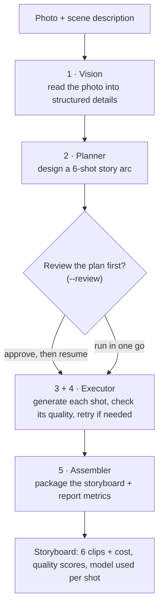
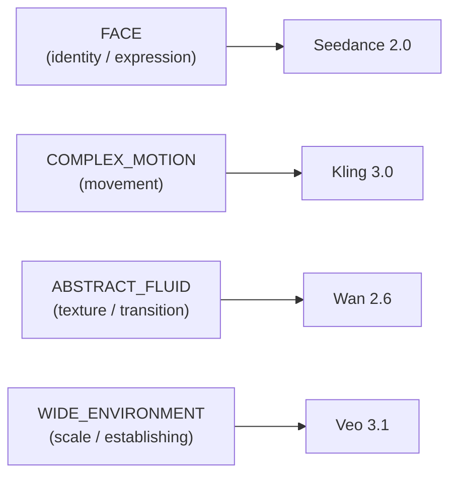
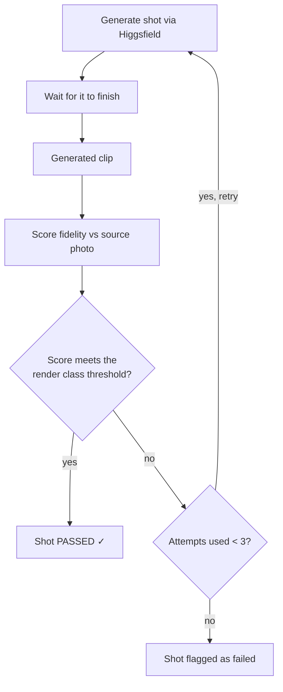
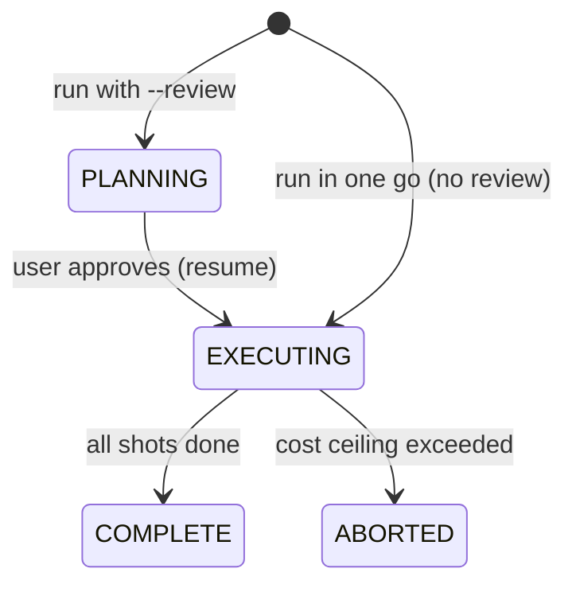

# DirectorAgent — Techno-Functional Overview

> **Audience:** product managers, engineering managers, and stakeholders who need
> to understand what DirectorAgent does, how it works, what it costs, and where
> it's going — without reading the source code. For implementation detail see
> `docs/TECHNICAL_DOCUMENTATION.md`; for the build plan see `BUILD_RUNBOOK.md`.
>
> **Living document.** **Status: complete, deployed, and live** at
> https://directoragent.onrender.com/docs (free-tier demo; first request after idle
> wakes in ~30–50s). The system is complete and verified to its testable boundary — the full pipeline runs, a real
> generation has been produced end to end, and an independent adversarial review of
> the finished code has been passed, and it is now deployed and running live. One
> optional item remains — a first paid generation over the REST transport (see §9).

---

## 1. What DirectorAgent is (the one-paragraph version)

DirectorAgent turns **a single photograph plus a short description** into a
**six-shot cinematic storyboard** — a sequence of short video clips that tell a
visual story while keeping the same character and setting consistent across every
shot, with controlled camera work and automatic quality checks. It is aimed at
anyone who needs to go from a single reference image to a directed, multi-shot
video sequence quickly and predictably: filmmakers, advertisers, content teams,
or product demos. The generation itself is done by Higgsfield's video models; what
DirectorAgent adds is the **direction** — choosing the right model for each shot,
structuring the shots into a story, checking each result for fidelity, and keeping
costs visible and bounded.

---

## 2. What it does, step by step

DirectorAgent works in five stages. Each stage has a clear input and output, and
they run in a fixed order — there is no unpredictable "AI deciding what to do
next." The creativity is in the content of each shot; the process around it is
deliberate and repeatable.

1. **Vision** — reads the photograph and turns it into structured details: who or
   what the subject is, the environment, the lighting, the mood, key objects, the
   colour palette. This is the system's "understanding" of the source image.
2. **Planner** — designs a six-shot story. It picks a narrative structure (an
   "arc"), and for each shot decides what it shows, how the camera moves, and
   writes a concrete instruction for the video model. It also chooses which video
   model is right for each shot — but that choice follows fixed rules (see §4), it
   is not improvised.
3. **Executor** — sends all six shots to Higgsfield to be generated, in parallel,
   then checks each finished clip for fidelity to the original photo. If a clip
   isn't faithful enough, it automatically retries (up to a limit).
4. **Quality check (drift detection)** — folded into the executor: every generated
   clip is compared against the source photo and scored. A clip that scores too
   low is regenerated.
5. **Assembler** — collects the approved clips into a storyboard, writes it to a
   file, and reports the numbers that matter: cost, how many shots passed on the
   first try, and the average fidelity score.

---

## 3. Key features (and why each matters)

**Directed, not random — deterministic model routing.** Higgsfield offers several
video models, each strong at different things. DirectorAgent always sends face
shots to the face-specialist model, wide establishing shots to the
environment-specialist model, and so on, by a fixed rule. This makes results
**predictable and auditable** — every model choice can be explained — rather than
a black box.

**Cinematic structure — story arcs.** Shots aren't generated in isolation; they're
arranged into a six-beat narrative (establish → introduce → build → turn → peak →
resolve, and other shapes). The user can pick the arc, or the system picks the
best-fitting one and explains its choice. This is what makes the output *read* as
a directed sequence rather than six unrelated clips.

**Consistent characters — groundedness.** The same person and setting carry across
all six shots, anchored to the original photo, while framing, angle, and action
vary freely from shot to shot. This is the core promise: one reference image, a
coherent sequence.

**Built-in quality control — drift detection with auto-retry.** Every clip is
scored for fidelity to the source. Below-threshold clips are automatically
regenerated, with stricter standards for faces (identity must hold) than for
abstract or atmospheric shots (more variation is acceptable).

**Cost is visible and bounded.** The system estimates the full cost *before*
generating anything and can stop if it would exceed a set ceiling. An optional
review step lets the user see the exact plan and projected cost and approve it
before any money is spent (see §5 and §6).

**Safe to interrupt — resumable.** Video generation takes minutes and costs real
money. If the process is interrupted, DirectorAgent can resume without
re-generating (and re-paying for) work already done.

**Try it for free — mock mode.** The entire pipeline can run end-to-end with no
credentials and no cost, producing placeholder results. This lets anyone evaluate
the workflow, and lets the team test continuously, before spending a cent.

**Bring your own vision model.** The image-understanding step (Vision) works with
OpenAI, Anthropic, or Google models interchangeably, and adding another is a small
change — users aren't locked into one provider.

---

## 4. How model routing works

Each shot is tagged with a **render class** — a category that determines which
Higgsfield model generates it and how strict the fidelity check is. There are four
render classes today, one per available model:

The AI suggests a render class for each shot, but the **model is always assigned by
the fixed rule above, never chosen freely by the AI**. This separation is
deliberate: it keeps routing predictable and explainable while still letting the AI
be creative about the *description* of each shot. (Adding a fifth model later is a
small, contained change — see §8.)

---

## 5. Cost model — how cost is calculated

**The cost model in real mode uses Higgsfield credits via a no-spend preflight.** Before generating anything, the system asks Higgsfield the exact credit cost of each planned shot — no estimate, no placeholder. Two real calibration points, both measured: Veo 3.1 at 8 seconds = **22 credits**; Wan 2.6 at 5 seconds = **13 credits** (this was the first real generation, and the credits charged matched the preflight figure exactly). The illustrative USD prices below are mock-mode placeholders only; real-mode costs are the credits returned by the preflight.

**The basic formula (mock mode / illustrative).** Each model has a price per second of generated video. A shot's cost is:

> shot cost = (model's price per second) × (shot duration in seconds)

A run's projected cost is the sum across all six shots. Illustrative per-second
prices (these are **placeholders to be calibrated against real Higgsfield
pricing** — see §8):

| Render class | Model | Price/sec (illustrative) |
|---|---|---|
| FACE | Seedance 2.0 | $0.10 (mock placeholder) |
| COMPLEX_MOTION | Kling 3.0 | $0.14 (mock placeholder) |
| ABSTRACT_FLUID | Wan 2.6 | $0.08 (mock placeholder) |
| WIDE_ENVIRONMENT | Veo 3.1 | $0.18 (mock placeholder; real = 22 credits / 8s) |

**Worked example.** This is the actual six-shot plan the system produces today
(dramatic arc), with durations already snapped to what each model supports:

| Shot | Model | Duration | Cost |
|---|---|---|---|
| 1 (wide establish) | Veo 3.1 | 8s | $1.44 |
| 2 (face) | Seedance 2.0 | 12s | $1.20 |
| 3 (motion) | Kling 3.0 | 10s | $1.40 |
| 4 (face) | Seedance 2.0 | 12s | $1.20 |
| 5 (motion) | Kling 3.0 | 10s | $1.40 |
| 6 (wide resolve) | Veo 3.1 | 8s | $1.44 |
| **Projected total** | | **60s** | **$8.08** |

**Durations are constrained by the models, not chosen freely.** Each Higgsfield
model accepts only certain clip lengths (Veo: 4, 6 or 8 seconds; Wan: 5, 10 or 15;
Kling: 3–15; Seedance: 4–15). The planner snaps every shot to its model's nearest
allowed value *after* the model is assigned, so a plan can never ask for a clip the
model cannot produce.

**The cost ceiling.** There is a configurable maximum (default $10). A run whose
projected cost exceeds it **stops before generating anything** — the operator either
raises the ceiling deliberately or revises the plan. This prevents surprise bills,
the failure mode that most often bites people running generative tools.

**Retries cost money.** If a shot fails the quality check and is regenerated, that
retry is a new paid job. So a shot that takes two attempts costs roughly twice as
much. This is why the **first-try yield** metric matters (see §6) — it's a direct
measure of cost efficiency.

**Where cost is shown.** With the review step enabled, the full plan and projected
cost are displayed *before* any spend, for explicit approval. After a run, the
storyboard reports the actual cost per shot and the run total.

---

## 6. Quality control — drift detection

"**Drift**" is how far a generated clip has strayed from the source photo. After a
clip is generated, it's scored for similarity to the original; the score is
compared against a threshold for that render class.

**Thresholds vary by render class** — stricter where fidelity matters most:

| Render class | Threshold | Why |
|---|---|---|
| FACE | 0.78 (strict) | Identity must hold — a face that drifts is wrong |
| COMPLEX_MOTION | 0.72 | Movement allows more variation |
| WIDE_ENVIRONMENT | 0.70 | Establishing scale tolerates change |
| ABSTRACT_FLUID | 0.65 (loose) | Atmospheric shots are meant to vary |

**First-try yield** is the share of shots that passed on their first attempt. A
yield of 83% means five of six shots were right the first time and one needed a
retry. It's both a **quality signal** (are prompts and routing working?) and a
**cost signal** (retries cost money), so it's the single most useful number for
judging a run's health.

---

## 7. The plan-review flow (cost gate before spend)

DirectorAgent separates *planning* (cheap, instant) from *generating* (slow,
costs money). This lets the user inspect and approve the plan before spending.

With `--review`, the system plans the six shots, saves the plan, shows it (the
chosen arc, each shot's description, model, and projected cost), and **stops before
spending**. The user reviews, then approves by resuming. Because the plan is saved,
the review can happen any time — the user can walk away and come back, and the same
plan is waiting. This design is also exactly what a future web interface would use:
plan, show, approve, generate.

---

## 8. Roadmap — what's built and what's coming

**Built, working, and deployed:** the full pipeline end-to-end — mock mode (free,
no credentials), the real Higgsfield adapter with **two transports** (agent-mediated,
proven live with a real 13-credit generation; REST, wired against the live Cloud API
and powering the deployed demo), real cost preview in agent mode, and **real
fidelity scoring** (CLIP against the source photo — a real generated clip scored 0.89
against its seed image vs 0.42 for an unrelated control). The system is **live at a
public URL** (https://directoragent.onrender.com/docs) via a thin web layer over the
same pipeline, running mock-mode by default so anyone can try it free.

**One optional item remains:** a first paid generation over the REST transport,
which would add a real DoP clip alongside the already-proven MCP generation. It is a
deliberate spend decision (the REST Cloud API bills from a separate credit pool), not
a code gap — everything is wired and tested. Real generation is already proven on the
agent-mediated path.

---

## 9. Deferred features and the reasoning

Nothing here is missing by accident — each was a deliberate prioritization call.

### Built since this document first listed them as deferred

Real Higgsfield generation, real fidelity (CLIP) scoring, the deployable REST
connection, and the plan-review cost gate are all **built**. A real generation has
been produced end to end (a 5-second clip, 13 credits, charged exactly what the
preflight quoted).

### Still deferred, deliberately

Nothing here is missing by accident — each was a deliberate prioritization call.

| Deferred item | Why deferred | When it's picked up |
|---|---|---|
| User-defined custom story arcs | The four built-in arcs cover the common cases; accepting fully custom arcs is an easy add once there's demand | On demand |
| Shot-to-shot chaining (each shot building on the previous one's output) | True chaining would make shots wait on each other and slow the parallel generation; v1 keeps all six independent and grounded to the source photo | When the quality benefit is proven to outweigh the speed cost |
| More than four models / render classes | The number of categories tracks the number of available models; four models exist today | When Higgsfield's model lineup grows |
| Heavier database (Postgres) for scale | A simple built-in database covers development and demos with zero setup; the system is built to swap to Postgres with a config change | At production scale |
| Automatic correction of mismatched shot categories | Trusting the AI's category choice (with a human review step as backstop) is simpler and avoids a fragile auto-corrector that could "fix" things that were right | Only if real usage shows frequent mismatches |
| Multi-frame fidelity sampling | Each clip is currently scored on a single mid-point frame — cheap and correct as a baseline | If real scores turn out not to track perceived fidelity |
| Web interface | The backend is intentionally built to support one (plan/approve/generate maps cleanly to a UI), but the CLI comes first | Future |

### Deploy status — three of four closed, one optional

The system is deployed and live. Three of the four items that once needed a real
environment are now closed; one remains, and it is an optional spend decision.

| Item | Status |
|---|---|
| The deployable (REST) connection's submit address | ✅ Resolved — confirmed against Higgsfield's Cloud API docs (`POST /{model_id}`). |
| Real cost preview over REST | ✅ Resolved — the Cloud API has no cost endpoint, so REST projects from the standard price table and reconciles the real charge after generation. |
| Real fidelity scoring on a real clip | ✅ Closed — a real generated clip scored 0.89 against its seed image vs 0.42 for an unrelated control. |
| A first paid generation over REST | ⬜ Optional — would add a real clip via the deployable path alongside the already-proven one. A deliberate spend decision (the REST product bills from a separate credit pool), not a missing piece. |

Note the two products: the agent-mediated path (used for the proven generation) and
the deployable REST path run against *different* Higgsfield model catalogs, unified
by one adapter — a stronger design story than two paths to the same place.

---

## 10. Key trade-offs and decisions (plain-language)

| Decision | The trade-off |
|---|---|
| **No heavyweight AI framework** (built on plain, well-understood components) | Faster to build, fully transparent, and easy to explain — at the cost of hand-building a few things a framework would provide. Chosen because the workflow is a fixed sequence, not a system that needs to branch unpredictably. |
| **Mock-first development** | The whole product runs free for evaluation and testing before any paid integration — at the cost of the real model connections coming later in the schedule. |
| **Deterministic model routing** | Predictable, explainable model choices — by design, the AI does not get to "freely pick" a model. This is a feature (auditability), not a limitation. |
| **Simple database by default** | Zero setup, clone-and-run — swappable to an industrial database for scale. |
| **Graded character consistency** | Same character across shots without making every shot a stiff copy of the photo; the balance between "locked" and "free" is tuned per shot type. May need fine-tuning on real images. |
| **Review before spend** | Strong protection against surprise costs — at the cost of one extra approval step (which a UI would make a single click). |

---

## 11. How the system was checked

**Automated checks run on every change.** Style, the full test suite (58 tests), a
complete end-to-end run in mock mode, and a re-run to confirm interrupted work
resumes without re-doing anything. These are mechanical and cannot be argued with.

**Rules that could otherwise drift are enforced by tests.** The design's own rules —
"the AI never picks the model," "the cost ledger is written before any money is
spent," "the heavy scoring engine is never loaded unless it's needed" — are written
as executable checks rather than trusted to memory.

**An independent review of the finished system found eight real problems.** After
everything was built and every automated check was green, a fresh reviewer with a
mandate to find fault — not to approve — went through the whole codebase. It found
eight genuine defects, three of them involving money: a review-only command that
could silently spend on a second use; a crash-recovery mechanism that could not
actually survive a crash; recovered work whose cost never reached the ledger; and a
spending limit that several parallel jobs could collectively overshoot. All eight
were fixed and then independently re-verified by a second reviewer. This history is
recorded rather than tidied away, because it is the strongest evidence the system
has been genuinely examined and not merely tested.

## Remaining risks and open questions

- **The planner's creative output** (how "filmable" the shot descriptions are) is
  expected to need a round of tuning on real photographs — normal for any AI-driven
  creative step.
- **Fidelity thresholds** may need adjustment once measured against real generated
  clips rather than controlled test data.
- **One optional item remains** (§9) — a first paid generation over the REST
  transport; a spend decision, not a code gap.

---

## 12. Glossary

- **Storyboard** — the final output: six short video clips in sequence, plus
  metrics (cost, quality scores, model per shot).
- **Shot** — one clip in the storyboard.
- **Arc** — the narrative structure of the six shots (e.g. establish → build →
  peak → resolve). The user can choose one or let the system pick.
- **Beat** — one step in an arc; the dramatic role a shot plays.
- **Render class** — the category that decides which model generates a shot and how
  strict its quality check is (FACE, COMPLEX_MOTION, ABSTRACT_FLUID,
  WIDE_ENVIRONMENT).
- **Shot style** — the free-form creative description of a shot (e.g. "slow
  push-in close-up"); separate from the render class, which handles routing.
- **Drift / drift score** — how far a generated clip has strayed from the source
  photo; higher is more faithful.
- **Drift threshold** — the minimum fidelity a shot must meet to pass; stricter for
  faces than for abstract shots.
- **Attempt** — one generation try for a shot. A shot that fails the quality check
  gets another attempt, up to a limit (3).
- **First-try yield** — the share of shots that passed on their first attempt; a
  combined quality-and-cost-efficiency metric.
- **Cost ceiling** — a configurable maximum spend; a run that would exceed it stops
  before generating.
- **Plan review** — an optional step that shows the full plan and projected cost
  for approval before any spend.
- **Mock mode** — running the whole pipeline with placeholder results, free and
  without credentials, for evaluation and testing.
- **Higgsfield / MCP** — the external service (and its integration protocol) that
  actually generates the video clips.
- **Resumable** — the ability to continue an interrupted run without re-generating
  (and re-paying for) completed work.
